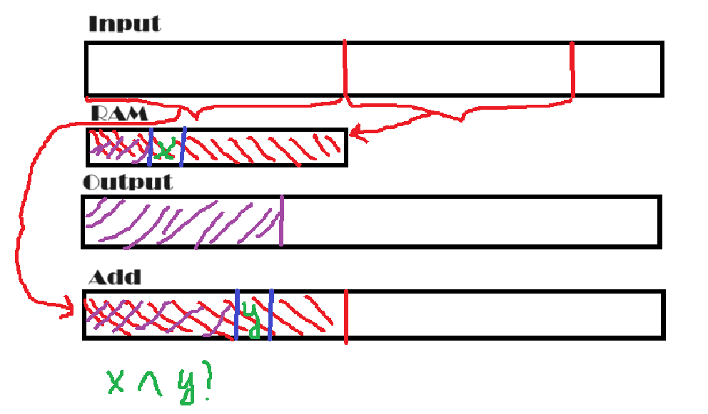

## Tape

### Запуск:

``` 
Yadro <input-file> <output-file> <configuration.json>
```

```
+---cmake-build         <--- исполняемые файлы
+---files               <--- файлы для запуска
+---libs                <--- библиотеки (json parser)
+---src
|   +---config          <--- модуль для обработки конфиг
|   +---sort            <--- класс с реализаций сортировки
|   \---tape            <--- класс с реализацией ленты
+---tests               <--- модульные тесты
\---tmp                 <--- файлы для временных лент
```

### Пример configuration.json:

``` json
{
  "recording_delay": 1000,
  "read_delay": 1500,
  "tape_rewind_delay": 10000,
  "tape_shift_delay": 100
}
```

Задержка в условных единицах  
Для парсинга использовал nlohmann/json библиотеку

## Описание алгоритма

Будем использовать три ленты: две даны, как входная и выходная, одна - дополнительная.

- Идем по входной ленте справо налево и заполняем по максимуму оперативную память. 
- В оперативной памяти сортируем полученные числа. 
- На выходной и дополнительной лентах будем поддерживать инвариант: на них записаны числа в остортированном виде (пустая лента тоже остортирована). 
- В зависимости от четности шага будем записывать либо в дополнительную ленту, либо в выходную. Пусть записываем в выходную (в дополнительную алгоритм аналогичный). Тогда возьмем указатель на оперативную память и на доп. ленту. Будем сравнивать значения на этих указателях и меньшее записывать в выходную ленту (старые значения пересотрутся). По итогу мы получим в выходной ленте отсортированный массив из значений оперативной памяти и доп. ленты.
- Повторяем алгоритм пока не вычитаем все данные из входной ленты
- Ответ будет лежать либо в доп. ленте, либо в выходной (в зависимости от четности номера последней итерации). Если оказался в доп. ленте, то перегоним из нее в выходную.



## Асимптотика

- Первая итерация: 
  - считать input: O(M * (read + shift)) - M / 4 раз читаем и двигаем ленту вправо
  - Отсортировать RAM: O(M * logM) - стандарт C++ гарантирует, что std::sort работает за такую асимптотику
  - Записать на ленту: O(M * (read + shift))
- Вторая итерация: 
  - Сбросить ленту output: O(rewind)
  - считать input: O(M * (read + shift))
  - Отсортировать RAM: O(M * logM)
  - Сравнить RAM с output и записать в add: 2 * M * (read + shift + write)
- Третья итерация:
  - Сбросить ленты: O(rewind)
  - считать input: O(M * (read + shift))
  - Отсортировать RAM: O(M * logM)
  - Сравнить RAM с add и записать в output: 3 * M * (read + shift + write)
- ...
- Последняя - N / (M * 4) итерация:
  - Сбросить ленты: O(rewind)
  - считать input: O(M * (read + shift))
  - Отсортировать RAM: O(M * logM)
  - Сравнить RAM с add и записать в output: N / (M * 4) * M * (read + shift + write)
  
Итого: N / (M * 4) * (rewind + M * (read + shift) + M * logM) + M * (read + shift + write) * (1 + N / (M * 4)) / 2 =>

Время: O(N/M * rewind + NlogM + (M + N) * (read + shift + write))

Память: O(1) - доп лент + O(M) для RAM

### Детали реализации

1. Из-за того, что нужно было реализовать операцию записи в произвольное место в файл, нужно, чтобы числа в файле были смещены. Чтобы не просить пользователя делать смещения в файлах, я создавал доплнительно смещенный файл. И, чтобы пользователю отдавать ответный файл без лишних смещений, я тоже создавал дополнитльный файл. Из-за этого может показаться, что я использую дополнительно три ленты, на самом деле, только одну.
2. В некоторых случая операцию rewind можно соптимизировать до нескольких shift_left
